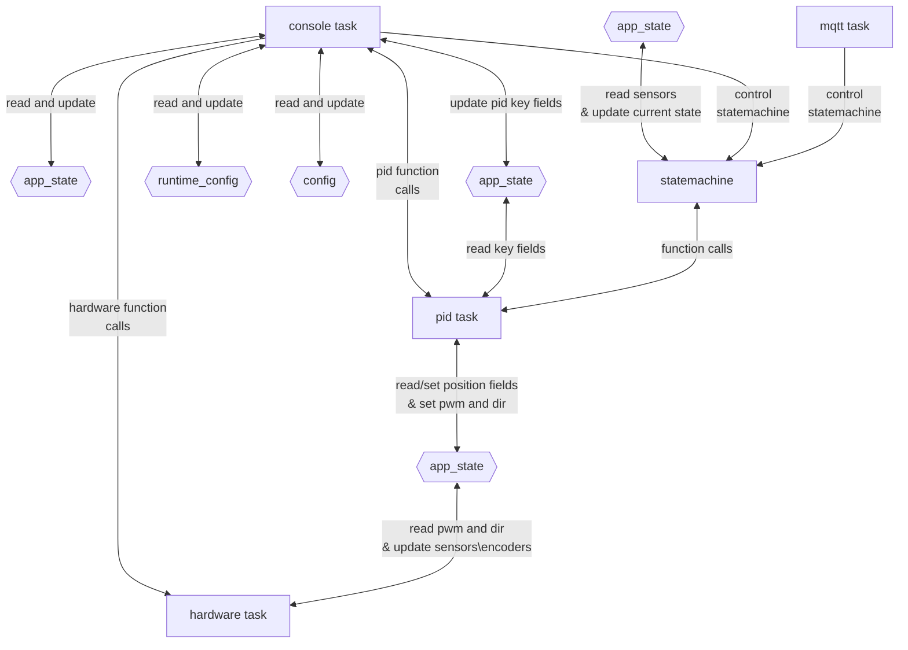
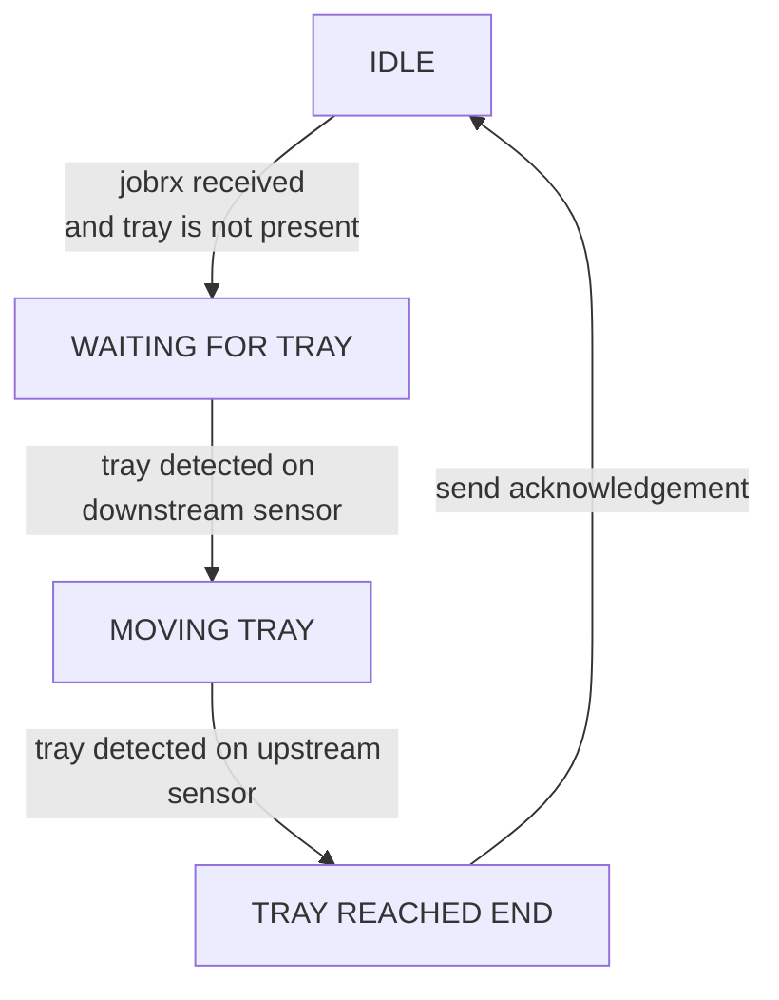
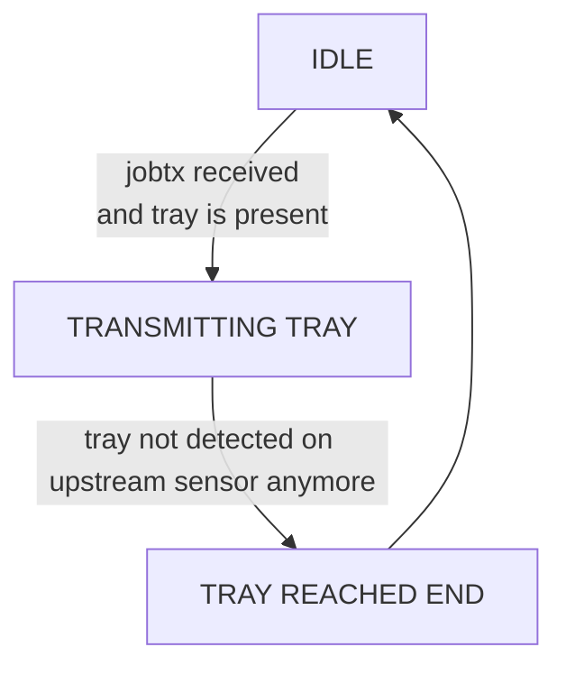

# Conveyor Firmware

ESP-IDF firmware for an ESP32-S3 motor-control node.

The current implementation is focused on local serial debugging, motor hardware
control, encoder/sensor polling, runtime config, per-motor PID task ownership,
receive/transmit tray state-machine jobs, and a small backend-facing MQTT command
path built on top of the same state-machine APIs.

## Current Status

Implemented:

- ESP console task with serial debug commands.
- BTS7960 motor driver output using RPWM/LPWM plus REN/LEN.
- Runtime config defaults, NVS load, NVS save, and serial config commands.
- Shared `motor_t motors[]` state with string motor IDs like `M0`.
- Hardware task for encoder and sensor polling.
- Raw motor output APIs: `set_motor()` and `stop_motor()`.
- One PID task per configured motor.
- PID APIs: `set_position()`, `get_position()`, `set_offset()`, and `setk()`.
- Conveyor state-machine APIs: `statemachine_jobrx()`, `statemachine_jobtx()`, and `statemachine_get_status()`.
- MQTT commands: `ack_test`, `tray_receive`, `tray_transmit`, and `get_commands`.

In progress / placeholders:

- Safety behavior.

## Architecture



## State Machine

Receive jobs move an incoming tray from the downstream sensor to the upstream
sensor. `statemachine_jobrx()` blocks until the job completes and returns the
terminal result.



Transmit jobs push a present tray upstream toward the next conveyor.
`statemachine_jobtx()` blocks until the job completes and returns the terminal
result.



## Main Modules

- `main/tasks/console.c`: ESP console command registration and serial command loop.
- `main/tasks/hardware.c`: motor GPIO/LEDC output, PCNT encoder setup, sensor polling.
- `main/tasks/pid.c`: per-motor PID task and PID-facing public APIs.
- `main/tasks/mqtt.c`: MQTT command, result, and node-status task.
- `main/tasks/safety.c`: safety placeholder task.
- `main/statemachine/statemachine.c`: receive/transmit tray state-machine task.
- `main/shared/app_state.c`: shared `motors[]` state and mutex.
- `main/config/runtime_config.c`: RAM/NVS runtime config values.
- `main/config/config.h`: compile-time identity, pin, and timing defaults.

## BTS7960 Motor Driver

Motor output is configured for a BTS7960 H-bridge driver in `main/config/config.h`:

```c
MOTOR_RPWM_GPIO = GPIO_NUM_15
MOTOR_LPWM_GPIO = GPIO_NUM_16
MOTOR_REN_GPIO = GPIO_NUM_7
MOTOR_LEN_GPIO = GPIO_NUM_8
```

`hardware_motor_init()` enables both `REN` and `LEN`, then configures separate
LEDC channels for `RPWM` and `LPWM`. `set_motor()` clears both PWM inputs before
applying a new direction. Positive direction drives `RPWM`; negative direction
drives `LPWM`. `stop_motor()` clears both PWM inputs.

Hardware bring-up note: on the current conveyor wiring, `setmotor M0 64 1`
drives motion that makes the encoder position decrease. Since the PID logic
expects positive direction to increase position, the RPWM/LPWM direction mapping
needs to be reversed before PID position tuning.

## Adding Runtime Config

Runtime config uses enum keys internally. Console names live in `console.c`. To
add a new value:

1. Add a key before `RUNTIME_CONFIG_COUNT` in `main/config/runtime_config.h`.
2. Add the matching value/NVS table entry in `main/config/runtime_config.c`.
3. Add the console name mapping in `s_runtime_configs[]` in `main/tasks/console.c`.

Example:

```c
RUNTIME_CONFIG_NEW_VALUE,
```

```c
[RUNTIME_CONFIG_NEW_VALUE] = {
    .nvs_key = "new_val",
    .default_value = 123,
    .value = 123,
},
```

```c
{"new_value", RUNTIME_CONFIG_NEW_VALUE},
```

After that, `getconfig`, `setconfig`, `resetconfig`, NVS load/save, and internal
`runtime_config_get()` / `runtime_config_set()` access work through the enum key.

## Adding Console Commands

Console commands are registered from one table in `main/tasks/console.c` by
`register_console_commands()` and handled by one switch in
`handle_console_command()`.

To add a command:

1. Add a value to `console_command_id_t`.
2. Add one row to `s_commands[]` with the command name, help text, and id.
3. Add one `case` in `handle_console_command()`.

Keep command behavior in that one handler unless the logic grows enough to
deserve its own module-level API.

## Serial Debug Commands

Current serial commands are documented in:

```text
docs/serial-debug-commands.md
```

Examples:

```text
setmotor M0 128 0
stop
stopmotor M0
setposition M0 1200
getposition M0
setoffset M0 0
setk M0 0.500 0.000 0.050
getconfig
setconfig max_pwm 200
resetconfig max_pwm
jobrx
jobtx
getstatus
status
```

## MQTT With Mosquitto

The firmware connects as an MQTT client using the compile-time values in
`main/config/config.h`:

```text
WiFi SSID: thrd_warehouse
Broker: 192.168.1.183:1883
ESP MQTT client id: factory
Machine id: C1
```

The active topics for this firmware image are:

```text
factory/conveyor/C1/command
factory/conveyor/C1/result
factory/conveyor/C1/node_status
```

Install the Mosquitto CLI tools on your development machine:

```bash
sudo apt install mosquitto-clients
```

Use unique Mosquitto client IDs so they do not collide with the ESP client id
`factory`. In one terminal, subscribe to command results:

```bash
mosquitto_sub -h 192.168.1.183 -p 1883 -i conveyor_result_debug -t 'factory/conveyor/C1/result' -v
```

In another terminal, subscribe to node status updates:

```bash
mosquitto_sub -h 192.168.1.183 -p 1883 -i conveyor_status_debug -t 'factory/conveyor/C1/node_status' -v
```

Publish an MQTT connectivity check:

```bash
mosquitto_pub -h 192.168.1.183 -p 1883 -i conveyor_cmd_debug -t 'factory/conveyor/C1/command' -m '{"command_id":"cmd_ack_001","command":"ack_test"}'
```

Expected result messages:

```json
{"command_id":"cmd_ack_001","command_status":"received","message":"command received"}
{"command_id":"cmd_ack_001","command_status":"success","message":"ack test ok"}
```

Ask the firmware which MQTT commands it supports:

```bash
mosquitto_pub -h 192.168.1.183 -p 1883 -i conveyor_cmd_debug -t 'factory/conveyor/C1/command' -m '{"command_id":"cmd_get_commands_001","command":"get_commands"}'
```

Start a tray receive job:

```bash
mosquitto_pub -h 192.168.1.183 -p 1883 -i conveyor_cmd_debug -t 'factory/conveyor/C1/command' -m '{"command_id":"cmd_rx_001","command":"tray_receive"}'
```

Start a tray transmit job:

```bash
mosquitto_pub -h 192.168.1.183 -p 1883 -i conveyor_cmd_debug -t 'factory/conveyor/C1/command' -m '{"command_id":"cmd_tx_001","command":"tray_transmit"}'
```

Tray commands return `received` first, then a final `success` or `failure` result.
If another tray job is active or already queued, the final message is a failure
with `message` set to `JOB_REJECTED`. Malformed JSON is logged by the firmware
and is not published as a correlated MQTT result.

The current MQTT command set is intentionally smaller than the serial console.
Backend MQTT supports only `ack_test`, `tray_receive`, `tray_transmit`, and
`get_commands`; local debug and low-level motion commands remain serial-console
features.

## Serial Web Driver

The `driver/` folder contains a browser-based serial debug driver for the
firmware. It is separate from the older `tools/conveyor_web` template and does
not use MQTT.

Install the Python dependencies:

```bash
python3 -m pip install -r driver/requirements.txt
```

Start the local web server:

```bash
python3 -m driver --host 127.0.0.1 --port 8080 --serial-port /dev/ttyACM0 --serial-baud 115200
```

Open the UI in a browser:

```text
http://127.0.0.1:8080
```

Typical workflow:

1. Flash the ESP32-S3 firmware and connect the board over USB Serial/JTAG.
2. Start the driver server with the serial port shown by your system, usually
   `/dev/ttyACM0` on Linux.
3. Click `Connect` in the web UI.
4. Use `Status`, `Get All Config`, `Job State`, `Position`, and `Sensors` for
   safe readback.
5. Use motor controls carefully. `Set Motor`, `Stop Motor`, and `Stop All`
   directly affect hardware output.

The web driver exposes the current ESP console commands over serial, including
`status`, `getstatus`, `getconfig`, `setconfig`, `resetconfig`, `jobrx`,
`jobtx`, `setmotor`, `stopmotor`, `stop`, `setposition`, `getposition`,
`positioncontrol`, `setoffset`, and `getsensors`. The raw console input can be
used for any firmware command that is not represented by a button.

### PID Tuning

The web UI includes a `PID Tuning` card for repeatedly trying position PID
values. KP, KI, and KD are entered as milli-unit runtime config values:

```text
500 = 0.500
50 = 0.050
```

The current firmware defaults in `main/shared/app_state.c` start `M0` with
`kp = 0.5`, `ki = 0.0`, and `kd = 0.05`.

`Apply Gains` sends these serial commands:

```text
setconfig pid_kp_milli <kp>
setconfig pid_ki_milli <ki>
setconfig pid_kd_milli <kd>
```

`Run Step + Return` applies the gains, enables position control, reads the
current position, moves by the configured relative `Step` count, polls
`getposition` until the target is within tolerance, then returns to the start
position. Use a small step first and keep `Disable PID after each trial` checked
while tuning. Use `Abort Tune` or `Stop All` immediately if movement is unsafe.

## Build

Use an ESP-IDF shell with `idf.py` available:

```bash
idf.py build
```

For the local ESP-IDF 6.0.1 setup used by this workspace, this command activates
the configured toolchain and builds for ESP32-S3:

```bash
. "/home/anbu/.espressif/tools/activate_idf_v6.0.1.sh" && IDF_TARGET=esp32s3 python "/home/anbu/.espressif/v6.0.1/esp-idf/tools/idf.py" build
```

Flash and monitor with the ESP-IDF commands appropriate for the connected
ESP32-S3 board.
