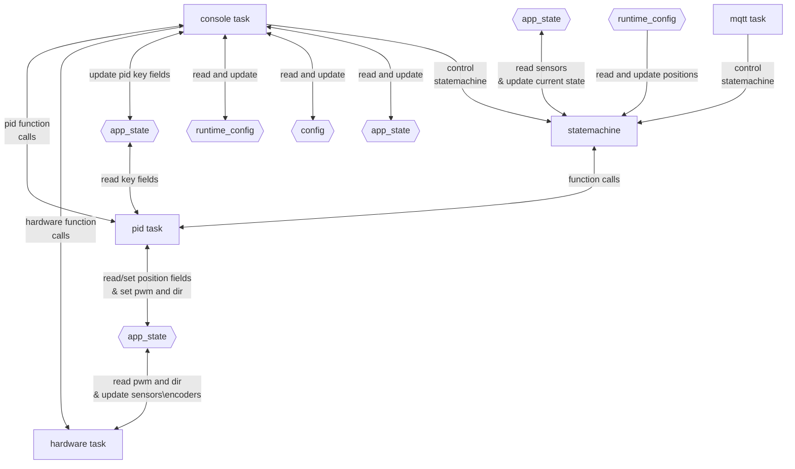

# Conveyor Firmware

ESP-IDF firmware for an ESP32-S3 motor-control node.

The current implementation is focused on local serial debugging, motor hardware
control, encoder/sensor polling, runtime config, and per-motor PID task
ownership. MQTT and the state machine are present as module placeholders and will
be built on top of the same shared state and control APIs.

## Current Status

Implemented:

- ESP console task with serial debug commands.
- Runtime config defaults, NVS load, NVS save, and serial config commands.
- Shared `motor_t motors[]` state with string motor IDs like `M0`.
- Hardware task for encoder and sensor polling.
- Raw motor output APIs: `set_motor()` and `stop_motor()`.
- One PID task per configured motor.
- PID APIs: `set_position()`, `get_position()`, `set_offset()`, and `setk()`.

In progress / placeholders:

- State machine behavior.
- MQTT command handling.
- Safety behavior.

## Architecture



## Main Modules

- `main/tasks/console.c`: ESP console command registration and serial command loop.
- `main/tasks/hardware.c`: motor GPIO/LEDC output, PCNT encoder setup, sensor polling.
- `main/tasks/pid.c`: per-motor PID task and PID-facing public APIs.
- `main/tasks/mqtt.c`: MQTT placeholder task.
- `main/tasks/safety.c`: safety placeholder task.
- `main/statemachine/statemachine.c`: state machine placeholder task.
- `main/shared/app_state.c`: shared `motors[]` state and mutex.
- `main/config/runtime_config.c`: RAM/NVS runtime config values.
- `main/config/config.h`: compile-time identity, pin, and timing defaults.

## Serial Debug Commands

Current serial commands are documented in:

```text
docs/serial-debug-commands.md
```

Examples:

```text
setmotor M0 128 0
stopmotor M0
setposition M0 1200
getposition M0
setoffset M0 0
setk M0 0.500 0.000 0.050
getconfig
setconfig max_pwm 200
resetconfig max_pwm
```

## Build

Use an ESP-IDF shell with `idf.py` available:

```bash
idf.py build
```

Flash and monitor with the ESP-IDF commands appropriate for the connected
ESP32-S3 board.
